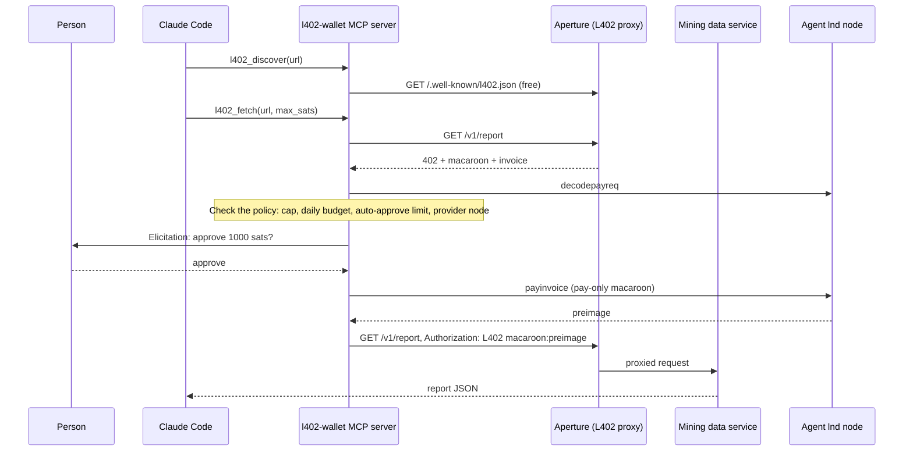

# L402 agent wallet with a spending policy

An MCP server that lets an AI agent find and pay for L402 services while a person stays in control of spending. The agent reads a provider's price list, pays small amounts automatically, asks a person before larger payments, refuses anything over its limits, and records a receipt for every decision. The payments are real Lightning payments on a local regtest network, sent through [Aperture](https://github.com/lightninglabs/aperture) v0.5.0 and lnd v0.21.3.

Built by Zachary Roth for the Lightning Labs AI Special Projects conversation on September 16, 2026.

## What it adds

Lightning Labs' agent stack can already charge for an API and pay a single L402 challenge. As of September 15, 2026, the pieces below were missing or still unmerged.

| Gap | Current state | This demo |
|---|---|---|
| Spending limits with a person in the loop | `lnget` caps each request. L402sdk budgets refuse over-limit payments and never ask anyone. The `lightning-agent-tools` MCP server is read-only. A proposal to add spending limits ([PR #25](https://github.com/lightninglabs/lightning-agent-tools/pull/25)) was closed without merging. | Payments at or below the auto-approve limit go through automatically. Larger payments open an approval prompt through MCP elicitation. Payments over the per-call cap or the daily budget are refused. If the MCP client can't prompt a person, the server refuses to pay. |
| Service discovery | The discovery spec ([L402 #27](https://github.com/lightninglabs/L402/pull/27)) and Aperture's manifest support ([aperture #241](https://github.com/lightninglabs/aperture/pull/241)) have been open since June. | The provider serves `/.well-known/l402.json` in the spec's manifest format. The agent reads prices before it buys. |
| Receipts and audit trail | lnget tracks spending with a `jq` sum over cached tokens. | Every payment, refusal, and declined approval is written to `receipts.jsonl`, with the payment hash and, for payments, the preimage as proof of payment. |
| Agent example on Anthropic tooling | The only first-party framework examples use the Vercel AI SDK and LangChain. | Works in Claude Code through a project `.mcp.json`. |

## How it works



The data service turns live [mempool.space](https://mempool.space) data into Bitcoin mining economics: hashprice, fee share of block rewards, the next difficulty adjustment, and break-even power prices. If mempool.space is unreachable, the service uses a saved snapshot and says so in its `source` field.

| Service | Path | Price |
|---|---|---|
| hashprice | `GET /v1/hashprice` | 10 sats |
| breakeven | `GET /v1/breakeven?j_per_th=17.5&usd_per_kwh=0.05` | 50 sats |
| report | `GET /v1/report` | 1,000 sats |

## Security choices

- **Least privilege:** the MCP server uses a baked lnd macaroon limited to `offchain:read`, `offchain:write`, and `info:read`. It can pay invoices but cannot open channels or send on-chain funds.
- **Invoice checks:** the server refuses an invoice with no fixed amount. It also refuses an invoice that pays a different node than the one named in the provider's manifest.
- **Proof of payment:** the server checks that `sha256(preimage)` matches the invoice's payment hash before storing a token. Aperture runs with `strictverify: true`, so it confirms the invoice settled.
- **Stored credentials:** paid tokens act as bearer credentials, so `tokens.json` and `receipts.jsonl` are created with owner-only permissions.
- **Routing fees:** each payment's routing fee is capped at 10 sats.

## Run it

You need Go 1.24 or later and Bun. Docker and Xcode are not required.

1. Build btcd, lnd, and Aperture from pinned source tags into `.bin/`. This takes a few minutes the first time.

   ```bash
   bun run build:binaries
   ```

2. Install the MCP SDK.

   ```bash
   bun install
   ```

3. Start a fresh regtest network. The script starts btcd and two lnd nodes, funds a 2,000,000-sat channel, and starts the data service and Aperture. It takes about 15 seconds and ends with `Ready.`

   ```bash
   bun run up
   ```

4. Run the end-to-end check. It drives the MCP server as a client would, scripts the approval answers, and asserts each policy path.

   ```bash
   bun run smoke
   ```

5. Stop everything.

   ```bash
   bun run down
   ```

`bun test` runs the policy unit tests without a network.

## Demo script (about 3 minutes)

1. Run `bun run up` and wait for `Ready.`
2. Run `claude` in this folder. On first launch, approve the project's `l402-wallet` MCP server.
3. Ask: *"What does the provider at http://127.0.0.1:8700 sell? Get the current hashprice and tell me whether a 17.5 J/TH miner is profitable at $0.06/kWh."* The agent reads the manifest, then pays 10 and 50 sats automatically.
4. Ask: *"Get the full desk report."* It costs 1,000 sats, which is over the 100-sat auto-approve limit, so Claude Code shows an approval prompt. Approve it.
5. Ask the same question again. The agent reuses the paid token and pays nothing.
6. Ask: *"Show my wallet."* The agent lists today's spend, the remaining budget, and a receipt for each decision.

The policy is set in `.mcp.json`: `L402_AUTO_APPROVE_SATS` (default 100) and `L402_DAILY_BUDGET_SATS` (default 5000).

## Limits

- **Regtest only.** No real funds move. The wallet backend runs `lncli` with fixed local ports. A production version would use gRPC or Lightning Node Connect.
- **Budget race.** The daily budget is counted per UTC day and checked without a lock, so two concurrent calls could both fit the budget.
- **Token reuse.** Tokens are reused per provider and service. The server retries only after a 401 or 402 response; it does not read macaroon expiry caveats.
- **Discovery.** The data service serves the manifest because Aperture v0.5.0 does not yet implement discovery. The manifest follows the unmerged spec in [L402 #27](https://github.com/lightninglabs/L402/pull/27). The quote endpoint is not implemented.
- **Only L402.** The server does not handle MPP `Payment` challenges, although Aperture also issues them.
- **Local access.** The data service on port 8701 listens only on localhost. In a real deployment, it would be reachable only through Aperture.

## Next steps

- Use a Wavelength wallet as the seller's invoice backend ([aperture #257](https://github.com/lightninglabs/aperture/pull/257)) so the provider needs no node.
- Enforce the budget in the node with litd accounts (`max-payment-size-msat`), not only in the MCP server.
- Get prices from Aperture's `/l402/quote` once #241 lands.
