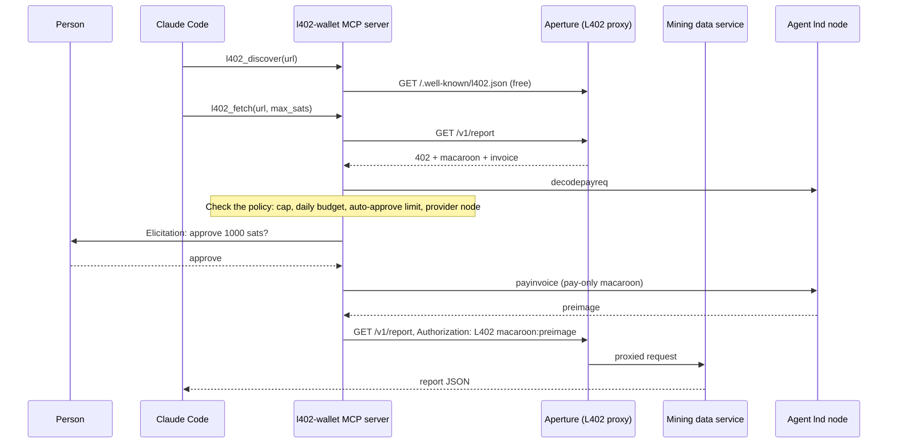

# L402 agent wallet with a spending policy

An MCP server that lets an AI agent find and pay for L402 services while a person stays in control of spending. The agent reads a provider's price list, pays small amounts automatically, asks a person before larger payments, refuses anything over its limits, and records a receipt for every decision. The payments are real Lightning payments on a local regtest network, sent through [Aperture](https://github.com/lightninglabs/aperture) v0.5.0 and lnd v0.21.3. The agent can also pay from a self-custodial [Wavelength](https://github.com/lightninglabs/wavelength) wallet instead of an lnd node.

Built by Zachary Roth for the Lightning Labs AI Special Projects conversation on September 16, 2026.

## What it adds

Lightning Labs' agent stack can already charge for an API and pay a single L402 challenge. As of September 15, 2026, the pieces below were missing or still unmerged.

| Gap | Current state | This demo |
|---|---|---|
| Spending limits with a person in the loop | `lnget` caps each request. L402sdk budgets refuse over-limit payments and never ask anyone. The `lightning-agent-tools` MCP server is read-only. A proposal to add spending limits ([PR #25](https://github.com/lightninglabs/lightning-agent-tools/pull/25)) was closed without merging. | Payments at or below the auto-approve limit go through automatically. Larger payments open an approval prompt through MCP elicitation. Payments over the per-call cap or the daily budget are refused. If the MCP client can't prompt a person, the server refuses to pay. |
| Service discovery | The discovery spec ([L402 #27](https://github.com/lightninglabs/L402/pull/27)) and Aperture's manifest support ([aperture #241](https://github.com/lightninglabs/aperture/pull/241)) have been open since June. | The provider serves `/.well-known/l402.json` in the spec's manifest format. The agent reads prices before it buys. |
| Receipts and audit trail | lnget tracks spending with a `jq` sum over cached tokens. | Every payment, refusal, and declined approval is written to `receipts.jsonl`, with the payment hash and, for payments, the preimage as proof of payment. |
| Agent spending on Wavelength | Wavelength's MCP server (`wavecli mcp serve`) exposes `send.prepare` and `send` with no spending policy, no approval step, and no L402 support. Its `send` result does not include the preimage. | Set `L402_WALLET=wavelength` and the same policy, approval prompt, and receipts run on top of Wavelength's wallet API. The agent reads the preimage from the settled wallet entry and verifies it before using the L402 token. |
| Agent example on Anthropic tooling | The only first-party framework examples use the Vercel AI SDK and LangChain. | Works in Claude Code through a project `.mcp.json`. |

## How it works


```mermaid
sequenceDiagram
    participant H as Person
    participant A as Claude Code
    participant W as l402-wallet MCP server
    participant P as Aperture (L402 proxy)
    participant S as Mining data service
    participant N as Agent lnd node

    A->>W: l402_discover(url)
    W->>P: GET /.well-known/l402.json (free)
    A->>W: l402_fetch(url, max_sats)
    W->>P: GET /v1/report
    P-->>W: 402 + macaroon + invoice
    W->>N: decodepayreq
    Note over W: Check the policy: cap, daily budget, auto-approve limit, provider node
    W->>H: Elicitation: approve 1000 sats?
    H-->>W: approve
    W->>N: payinvoice (pay-only macaroon)
    N-->>W: preimage
    W->>P: GET /v1/report, Authorization: L402 macaroon:preimage
    P->>S: proxied request
    S-->>A: report JSON
```

The data service turns live [mempool.space](https://mempool.space) data into Bitcoin mining economics: hashprice, fee share of block rewards, the next difficulty adjustment, and break-even power prices. If mempool.space is unreachable, the service uses a saved snapshot and says so in its `source` field.

| Service | Path | Price |
|---|---|---|
| hashprice | `GET /v1/hashprice` | 10 sats |
| breakeven | `GET /v1/breakeven?j_per_th=17.5&usd_per_kwh=0.05` | 50 sats |
| report | `GET /v1/report` | 1,000 sats |

## Security choices

- **Least privilege:** with lnd, the MCP server uses a baked macaroon limited to `offchain:read`, `offchain:write`, and `info:read`. It can pay invoices but cannot open channels or send on-chain funds. With Wavelength, it uses a macaroon scoped to four wallet methods (see below).
- **One payment decision at a time:** the budget check, approval, and payment run under a lock, so concurrent calls cannot both fit the same remaining budget.
- **Unsettled payments count:** if a Wavelength payment is still pending when the server stops waiting, its amount is recorded against the daily budget, because it may still settle.
- **Invoice checks:** the server refuses an invoice with no fixed amount. With lnd, it also refuses an invoice that pays a different node than the one named in the provider's manifest.
- **Proof of payment:** the server checks that `sha256(preimage)` matches the invoice's payment hash before storing a token. Aperture runs with `strictverify: true`, so it confirms the invoice settled.
- **Stored credentials:** paid tokens act as bearer credentials, so `tokens.json` and `receipts.jsonl` are created with owner-only permissions.
- **Routing fees:** each payment's routing fee is capped at 10 sats.

## Run it

You need Go 1.24 or later and Bun. Docker and Xcode are not required.

1. Build btcd, lnd, and Aperture from pinned source tags into `.bin/`. This takes a few minutes the first time.

   ```bash
   bun run build:binaries
   ```

2. Install the MCP SDK.

   ```bash
   bun install
   ```

3. Start a fresh regtest network. The script starts btcd and two lnd nodes, funds a 2,000,000-sat channel, and starts the data service and Aperture. It takes about 15 seconds and ends with `Ready.`

   ```bash
   bun run up
   ```

4. Run the end-to-end check. It drives the MCP server as a client would, scripts the approval answers, and asserts each policy path.

   ```bash
   bun run smoke
   ```

5. Stop everything.

   ```bash
   bun run down
   ```

`bun test` runs the policy tests and the Wavelength backend tests without a network. The Wavelength tests use a fake `waved` gateway that returns the wallet API's JSON shapes.

The policy is set in `.mcp.json`: `L402_AUTO_APPROVE_SATS` (default 100) and `L402_DAILY_BUDGET_SATS` (default 5000).

## Pay from a Wavelength wallet

Wavelength is Lightning Labs' self-custodial payment toolkit. The `waved` daemon holds funds in Ark and pays Lightning invoices through atomic swaps, so the agent needs no Lightning node or channels. The seller side is unchanged: Aperture and the seller's lnd still issue the invoice.

The Wavelength backend uses the daemon's wallet REST API:

1. `POST /v1/wallet/prepare-send` validates the invoice and returns its amount, payment hash, settlement rail, and a single-use `send_intent_id`. No funds move. The spending policy and approval prompt run on this preview.
2. `POST /v1/wallet/send` consumes the intent. The same preview cannot be paid twice.
3. `POST /v1/wallet/list` is polled until the send entry is `ENTRY_STATUS_COMPLETE` or `ENTRY_STATUS_FAILED`. A completed Lightning-backed entry carries the preimage in `progress.preimage`, which the server checks against the payment hash before building the L402 token.

Give the agent a macaroon that can only prepare, send, list, and read the balance. It cannot exit, sweep, or create wallets:

```bash
wavecli bakemacaroon \
  uri:/wavewalletrpc.WalletService/PrepareSend \
  uri:/wavewalletrpc.WalletService/Send \
  uri:/wavewalletrpc.WalletService/List \
  uri:/wavewalletrpc.WalletService/Balance \
  --save-to agent-pay.macaroon
```

Then point the MCP server at the daemon's gateway in `.mcp.json`:

```json
"env": {
  "L402_WALLET": "wavelength",
  "WAVELENGTH_URL": "https://localhost:10031",
  "WAVELENGTH_MACAROON_PATH": "/path/to/agent-pay.macaroon",
  "WAVELENGTH_TLS_CERT": "/path/to/waved/tls.cert"
}
```

The waved daemon must be built with `make install-wavewalletrpc` and run with `rpc.gateway.enabled=true`.

**Open question: same-Ark payments.** Wavelength's swap server can settle an invoice between two wallets on the same Ark (`SEND_RAIL_IN_ARK`) without touching Lightning. Wavelength documents the preimage only for Lightning-backed sends. If a same-Ark payment completes without a preimage, the buyer has paid but has no L402 proof of payment. [L402 PR #23](https://github.com/lightninglabs/L402/pull/23) proposes that wallets must reveal the preimage in this case. This server does not assume either answer. It records the payment against the budget, stores no token, and tells the agent there is no proof of payment.

## Limits

- **Regtest only.** No real funds move. The lnd backend runs `lncli` with fixed local ports. A production version would use gRPC or Lightning Node Connect.
- **Wavelength not run live.** The Wavelength backend follows `wavewalletrpc` at wavelength commit `2c4f1ee` (September 29, 2026) and is tested against a fake gateway. It has not paid through a real `waved` daemon. That needs an Ark operator and swap server, which Lightning Labs runs on signet and testnet but which are not in the open-source repository.
- **No payee check on Wavelength.** `prepare-send` does not return the payee node, so the manifest's `node_pubkey` is checked only with the lnd backend.
- **One process.** The spending lock and ledger are per server process. Two MCP servers sharing one wallet would each enforce their own budget.
- **Token reuse.** Tokens are reused per provider and service. The server retries only after a 401 or 402 response; it does not read macaroon expiry caveats.
- **Discovery.** The data service serves the manifest because Aperture v0.5.0 does not yet implement discovery. The manifest follows the unmerged spec in [L402 #27](https://github.com/lightninglabs/L402/pull/27). The quote endpoint is not implemented.
- **Only L402.** The server does not handle MPP `Payment` challenges, although Aperture also issues them.
- **Local access.** The data service on port 8701 listens only on localhost. In a real deployment, it would be reachable only through Aperture.

## Next steps

- Use a Wavelength wallet as the seller's invoice backend ([aperture #257](https://github.com/lightninglabs/aperture/pull/257)) so the provider needs no node.
- Run the Wavelength backend against Lightning Labs' signet Ark and swap servers, paying a signet Aperture.
- Enforce the budget in the node with litd accounts (`max-payment-size-msat`), not only in the MCP server.
- Get prices from Aperture's `/l402/quote` once #241 lands.
