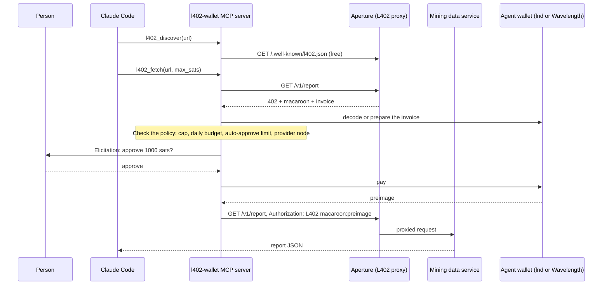

# L402 agent wallet with a spending policy

An MCP server that lets an AI agent pay for L402 services while a person controls spending. The agent reads a provider's price list, pays small amounts automatically, asks a person before larger payments, refuses anything over its limits, and keeps a receipt for every decision. The wallet can be an lnd node or a self-custodial [Wavelength](https://github.com/lightninglabs/wavelength) wallet.

Payments are real Lightning payments on regtest, through [Aperture](https://github.com/lightninglabs/aperture) v0.5.0 and lnd v0.21.3. Built by Zachary Roth for Lightning Labs.

## What it adds

| Gap in Lightning Labs' agent stack | This demo |
|---|---|
| No spending limits with a person in the loop. `lnget` and L402sdk only refuse, and the spending-limits PR ([lightning-agent-tools #25](https://github.com/lightninglabs/lightning-agent-tools/pull/25)) closed unmerged. | Pays automatically up to 100 sats, asks a person through MCP elicitation above that, and refuses anything over the per-call cap or daily budget. |
| Service discovery is unmerged ([L402 #27](https://github.com/lightninglabs/L402/pull/27), [aperture #241](https://github.com/lightninglabs/aperture/pull/241)). | The provider serves `/.well-known/l402.json`, so the agent sees prices before it buys. |
| No audit trail. | Every payment, refusal, and decline goes to `receipts.jsonl` with the payment hash and preimage. |
| Wavelength's MCP `send` has no policy, no approvals, no L402 support, and returns no preimage. | `L402_WALLET=wavelength` runs the same policy on Wavelength's wallet API and verifies the preimage. |
| No Claude example. | Works in Claude Code through `.mcp.json`. |

## How it works


```mermaid
sequenceDiagram
    participant H as Person
    participant A as Claude Code
    participant W as l402-wallet MCP server
    participant P as Aperture (L402 proxy)
    participant S as Mining data service
    participant N as Agent wallet (lnd or Wavelength)

    A->>W: l402_discover(url)
    W->>P: GET /.well-known/l402.json (free)
    A->>W: l402_fetch(url, max_sats)
    W->>P: GET /v1/report
    P-->>W: 402 + macaroon + invoice
    W->>N: decode or prepare the invoice
    Note over W: Check the policy: cap, daily budget, auto-approve limit, provider node
    W->>H: Elicitation: approve 1000 sats?
    H-->>W: approve
    W->>N: pay
    N-->>W: preimage
    W->>P: GET /v1/report, Authorization: L402 macaroon:preimage
    P->>S: proxied request
    S-->>A: report JSON
```

The paid service sells Bitcoin mining economics from live [mempool.space](https://mempool.space) data: `hashprice` (10 sats), `breakeven` (50 sats), and a full `report` (1,000 sats).

## Security

- **Least privilege:** the lnd macaroon can pay invoices but cannot open channels or send on-chain. The Wavelength macaroon can only prepare, send, list, and read the balance.
- **Invoice checks:** refuses invoices with no fixed amount, and, on lnd, invoices that pay a node other than the manifest's.
- **Proof of payment:** checks `sha256(preimage)` against the payment hash before storing a token.
- **No budget races:** the budget check, approval, and payment run under a lock. A payment still pending at timeout counts against the budget.
- **Fees and storage:** routing fees are capped at 10 sats; tokens and receipts are owner-only files.

## Run it

Requires Go 1.24+ and Bun.

```bash
bun run build:binaries   # build btcd, lnd, and Aperture into .bin/ (first run takes a few minutes)
bun install
bun run up               # regtest network, channel, data service, and Aperture (~15 s)
bun run smoke            # end-to-end check of every policy path
bun run down
```

`bun test` runs the unit tests without a network. Set the policy in `.mcp.json` with `L402_AUTO_APPROVE_SATS` (default 100) and `L402_DAILY_BUDGET_SATS` (default 5000).

## Pay from Wavelength

Wavelength's `waved` daemon holds funds in Ark and pays Lightning invoices through swaps, so the agent needs no node or channels. The backend calls `prepare-send` to preview the payment (the policy runs here, before funds move), `send` to pay it, and `list` to wait for the preimage.

```bash
wavecli bakemacaroon \
  uri:/wavewalletrpc.WalletService/PrepareSend \
  uri:/wavewalletrpc.WalletService/Send \
  uri:/wavewalletrpc.WalletService/List \
  uri:/wavewalletrpc.WalletService/Balance \
  --save-to agent-pay.macaroon
```

```json
"env": {
  "L402_WALLET": "wavelength",
  "WAVELENGTH_URL": "https://localhost:10031",
  "WAVELENGTH_MACAROON_PATH": "/path/to/agent-pay.macaroon",
  "WAVELENGTH_TLS_CERT": "/path/to/waved/tls.cert"
}
```

Build `waved` with `make install-wavewalletrpc` and set `rpc.gateway.enabled=true`.

**Open question:** Wavelength can settle between two wallets on the same Ark (`SEND_RAIL_IN_ARK`) without Lightning. If that returns no preimage, the buyer has paid but has no L402 proof ([L402 #23](https://github.com/lightninglabs/L402/pull/23)). The server counts the payment, stores no token, and tells the agent.

## Limits

- **Regtest only.** The lnd backend shells out to `lncli`; production would use gRPC or Lightning Node Connect.
- **Wavelength not run live.** It is tested against a fake gateway built from wavelength commit `2c4f1ee`. A live run needs Lightning Labs' signet Ark and swap servers.
- **No payee check on Wavelength.** `prepare-send` does not return the payee node.
- **One process.** The lock and ledger are per server process.
- **Tokens** ignore macaroon expiry caveats and retry only after a 401 or 402.
- **L402 only.** No MPP challenges and no quote endpoint.

## Next steps

- Pay a signet Aperture from a signet Wavelength wallet.
- Use Wavelength as the seller's invoice backend ([aperture #257](https://github.com/lightninglabs/aperture/pull/257)).
- Enforce budgets in the node with litd accounts.
